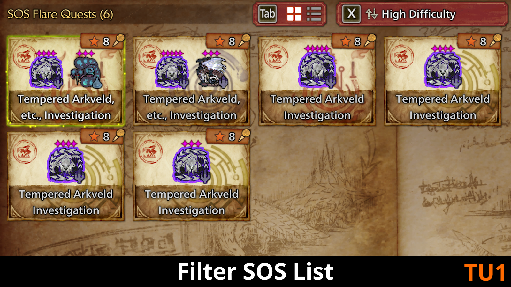

  
  
  

Filters the SOS list based on various customizable parameters such as desired bonus rewards or the maximum of a reward.
 
 
希望するボーナス報酬や報酬の最大値など、カスタマイズ可能な様々なパラメータに基づいてSOSリストをフィルタリングします。
 
 
How to install:

1. Install [REFramework](https://www.nexusmods.com/monsterhunterwilds/mods/93)
2. Download this mod from the [Releases](https://github.com/mashirochan/MHWS-FilterSOSList/releases/tag/v1.5.0) page
3. Extract this mod from its .zip file
4. Copy the "reframework" folder into the root directory of your Monster Hunter Wilds game. For Steam users, this will be `C:\Program Files (x86)\Steam\steamapps\common\MonsterHunterWilds\`

How to use:
1. Open the REFramework menu with the "Insert" key
2. Expand the Script Generated UI menu
3. Expand the "Filter SOS List" menu
4. Add or remove your desired filters
5. Search for SOS quests for your desired monster

If you have any questions or issues, please feel free to leave a comment!

This mod was created with much help from the wonderful [Monster Hunter Modding Discord](https://discord.gg/gJwMdhK), thank you so much! <3

Japanese translation provided by [DeepL](https://www.deepl.com/):

インストール方法:

1. [REFramework](https://www.nexusmods.com/monsterhunterwilds/mods/93)をインストールする
2. [Releases](https://github.com/mashirochan/MHWS-FilterSOSList/releases/tag/v1.5.0)タブからこのMODをダウンロードする
3. zipファイルからこのMODを解凍する
4. 「reframework」フォルダをモンスターハンターワイルドのルートディレクトリにコピーします
    例：Steamユーザーの場合、`C:\Program Files (x86)\Steam\steamapps\common\MonsterHunterWilds\`になります

使用方法:

1. 挿入キーでREFrameworkメニューを開く
2. スクリプト生成UIメニューを展開する
3. 「Filter SOS List」メニューを展開する
4. フィルターの追加と削除
5. 希望するモンスターのSOSクエストを検索する

ご質問や問題がありましたら、お気軽にコメントを残してください！

このMODは素晴らしい[モンスターハンターMODのDiscord](https://discord.gg/gJwMdhK)から多くの助けを得て作成されました、本当にありがとうございます！<3 
